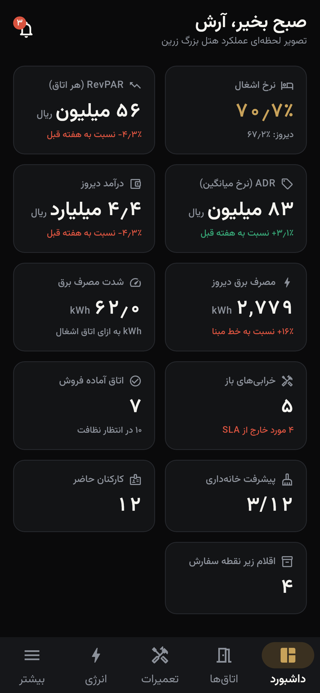
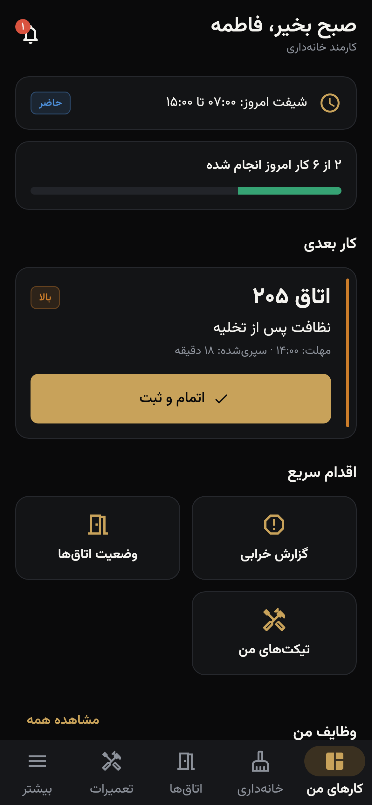

# زرین هوشمند · Zarin Hooshmand

**Smart Optimization Platform for Hospitality.** A platform for hotels to record their operational data, analyse it, automate the routine work and get AI suggestions.

```
ثبت داده → تحلیل → پیشنهاد AI → تصمیم مدیر → بهبود عملیات → کاهش هزینه → افزایش بهره‌وری
```

The MVP is a sellable product built so AI, IoT, sensors, a digital twin, predictive analytics and a dedicated backend can be added later without rewriting it.

| | |
|:-:|:-:|
|  |  |
| Executive dashboard (General Manager) | "My work" (housekeeper, one-tap flow) |

## Repository

```
app/        Flutter app: Android 10+ and iOS 15+. Clean Architecture, Riverpod, go_router, Material 3, RTL
firebase/   Firestore and Storage rules, indexes, Cloud Functions (TypeScript), seed, tests
n8n/        Automation workflows (alerts → Bale/SMS/e-mail, morning briefing, SLA escalation, IoT ingestion)
docs/       Architecture and product documentation (Persian), mapped to every requested deliverable
```

The deliverables index is in **[docs/README.md](docs/README.md)**: architecture, data model and schema, roles, UI flow and journeys, wireframes, API, n8n, AI plan and roadmaps.

## Quick start: runnable demo (no backend needed)

```bash
cd app
flutter pub get
flutter run            # offline demo backend with a seeded 60-room hotel
```

Sign in by tapping a role chip on the login screen, or with a national ID and the password `Zarin@2026`:

| Role | National ID | Role | National ID |
|---|---|---|---|
| General Manager | `0012345679` | Housekeeper | `0102345678` |
| Hotel Owner | `0023456787` | Maintenance technician | `0124567894` |
| Operations Manager | `0034567895` | Reception | `0091234565` |
| Energy Manager | `0045678911` | Restaurant Manager | `0135678919` |
| Maintenance Manager | `0056789122` | Restaurant staff | `0168912341` |
| Housekeeping Manager | `0067891233` | Analyst | `0146789121` |
| Inventory Manager | `0078912342` | HR Manager | `0089123451` |
| Super Admin | `0157891232` | | |

## Firebase backend

```bash
npm i -g firebase-tools
cd firebase/functions && npm ci

# Local: emulators + seed (same accounts as above)
cd ../.. && firebase emulators:start
cd firebase/functions && FIRESTORE_EMULATOR_HOST=localhost:8080 \
  FIREBASE_AUTH_EMULATOR_HOST=localhost:9099 GCLOUD_PROJECT=demo-zarin npm run seed

# App against Firebase
cd app && flutterfire configure        # then set DefaultFirebaseOptions.isConfigured = true
flutter run --dart-define=ZH_BACKEND=firebase [--dart-define=ZH_USE_EMULATORS=true]

# Deploy
firebase functions:secrets:set ANTHROPIC_API_KEY
firebase functions:secrets:set INTEGRATION_SECRET
firebase deploy --only firestore,storage,functions
```

n8n setup is covered in [n8n/README.md](n8n/README.md).

## Quality gates

| Command | Covers |
|---|---|
| `cd app && flutter analyze && flutter test` | Lints, plus 31 unit and widget tests: RBAC, router guard, domain policies, login → one-tap cleaning flow |
| `cd firebase/functions && npm run typecheck && npm test` | TypeScript, plus 18 unit tests: RBAC drift guard against the Dart policy and the rules, analytics, rule engine |
| `npm run test:rules` | 20 Firestore Security Rules tests on the emulator (tenant isolation, forged actors, illegal transitions, ledger) |
| `npm run test:integration` | 7 end-to-end function tests against the Auth and Firestore emulators |
| `npm run gen:rules` | Regenerates the RBAC block of `firestore.rules` from `rbac.ts` |

## Architecture at a glance

- **Backend-agnostic.** Features depend on repository interfaces. Adapters are `data/firebase` (current) and `data/demo` (offline), with a REST adapter planned for the dedicated PostgreSQL backend. Binding happens in one file.
- **Security in depth.** Role-filtered UI, a router guard (deep links included), then **Firestore Rules and Cloud Functions** as the actual enforcement. Changing the UI or the route never exposes data.
- **Explainable analytics first, LLM second.** KPIs and rule-based insights are computed server-side. The LLM (behind an `LlmProvider` port, with server-side fallback) only explains and narrates.
- **Automation never breaks operations.** n8n gets HMAC-signed, fire-and-forget events. In-app alerts and push notifications come from the backend itself.

> **Iran deployment note:** access to Google (Firebase/FCM) or Anthropic services from Iran may be restricted. The architecture isolates these behind ports, and the roadmap moves to an in-country backend and push provider (see [docs/08-roadmap.md](docs/08-roadmap.md)).
