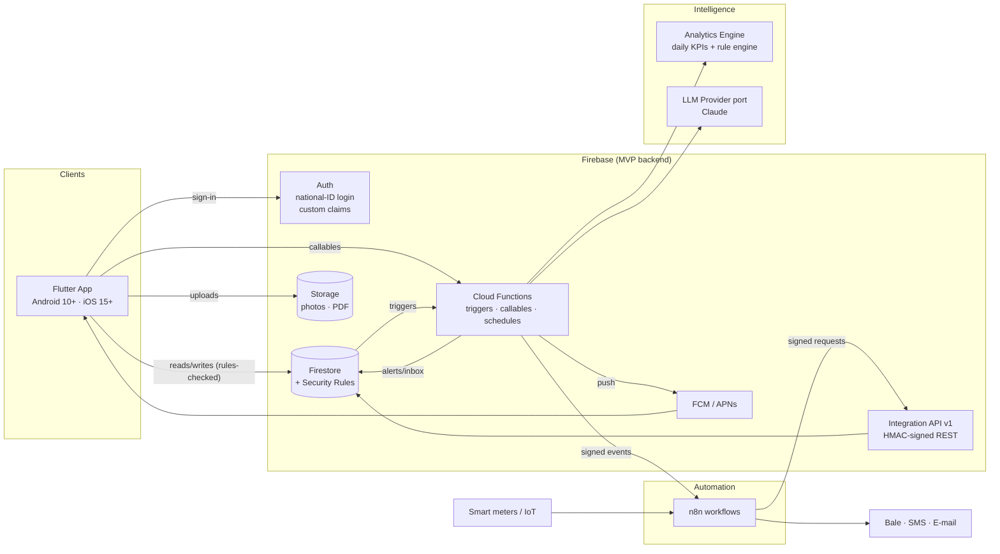
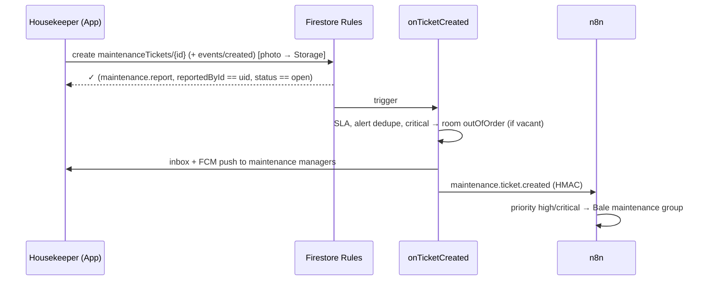

# ۱. معماری کامل پروژه

## فلسفهٔ محصول

زرین هوشمند فقط فرم‌ساز یا داشبورد نیست. یک **چرخهٔ تصمیم** است:

```
ثبت داده ──► تحلیل ──► پیشنهاد AI ──► تصمیم مدیر ──► بهبود عملیات ──► کاهش هزینه ──► افزایش بهره‌وری
   ▲                                                                                          │
   └──────────────────────────── داده‌های جدید (دستی امروز، IoT فردا) ◄──────────────────────┘
```

MVP همین چرخه را با **ورود دستی داده** کامل اجرا می‌کند. هر جزء طوری ساخته شده که بعداً بتوان منبع داده (سنسور، کنتور هوشمند، PMS)، موتور تحلیل (پیش‌بینی، Digital Twin) و زیرساخت (سرور اختصاصی و PostgreSQL) را عوض کرد، بدون اینکه بقیهٔ چرخه تغییر کند.

## نمای کلان (System Context)



زنجیرهٔ درخواستی کارفرما (`Frontend → Firebase → API Layer → n8n → AI Services → Analytics Engine → Dashboard`) به این شکل پیاده شده است:

| حلقه | پیاده‌سازی در MVP | محل کد |
|---|---|---|
| Frontend | Flutter (Material 3، RTL، ریسپانسیو) | `app/` |
| Firebase | Auth + Firestore + Storage. امنیت در Security Rules | `firebase/*.rules` |
| API Layer | Callable Functions برای اپ و REST v1 با امضای HMAC برای n8n و IoT | `firebase/functions/src/{admin,auth,ai,api}` |
| n8n | ۴ workflow: مسیریابی رویداد، گزارش صبحگاهی، Escalation، ورود داده از کنتور | `n8n/workflows` |
| AI Services | پورت `LlmProvider` با پیاده‌سازی Claude: دستیار گفتگو و خلاصهٔ مدیریتی | `firebase/functions/src/ai` |
| Analytics Engine | محاسبهٔ روزانهٔ KPI و موتور قواعد قابل‌توضیح (Explainable rules) | `firebase/functions/src/analytics` |
| Dashboard | داشبورد اختصاصی هر نقش (Executive / Operations / Staff) | `app/lib/features/dashboard` |

## اصول معماری

1. **Backend-agnostic (Ports & Adapters).** اپ فقط interfaceهای Repository را در لایهٔ domain هر feature می‌شناسد. سه Adapter وجود دارد یا برنامه‌ریزی شده است:
   - `data/firebase`: فعلی.
   - `data/demo`: آفلاین، برای دمو فروش و تست.
   - `data/rest`: بک‌اند اختصاصی آینده.

   انتخاب Adapter فقط در یک فایل انجام می‌شود (`data/repository_providers.dart`).
2. **سرور مرجع نهایی مجوز است.** UI منوها را بر اساس نقش فیلتر می‌کند و Router هم مسیرهای غیرمجاز را می‌بندد، ولی امنیت واقعی در **Firestore Rules** و **Cloud Functions** است. حتی اگر اپ دستکاری شود، دادهٔ غیرمجاز خوانده یا نوشته نمی‌شود (رجوع کنید به [۰۲](02-roles-and-security.md)).
3. **ورود دستی امروز همان IoT فرداست.** قرائت انرژی، چه دستی وارد شود، چه از کنتور هوشمند (`POST /energy/readings`) و چه از import، یک شکل سند دارد و فقط فیلد `source` فرق می‌کند. به همین دلیل تحلیل‌ها و داشبوردها با آمدن سنسورها تغییر نمی‌کنند.
4. **اول تحلیل قابل‌توضیح، بعد LLM.** اعداد را موتور تحلیل حساب می‌کند و LLM فقط آن‌ها را تفسیر و روایت می‌کند. به این ترتیب هزینه کنترل می‌شود، خطای عددی (hallucination) پیش نمی‌آید، و اگر سرویس AI در دسترس نباشد، پیشنهادها همچنان تولید می‌شوند.
5. **اتوماسیون نباید عملیات را بشکند.** ارسال رویداد به n8n به‌صورت fire-and-forget است. هشدار، اعلان درون‌برنامه‌ای و Push مستقیماً از خود بک‌اند ساخته می‌شوند.
6. **Multi-tenant از روز اول.** همهٔ داده‌های عملیاتی زیر `hotels/{hotelId}/…` قرار دارند و claim به نام `hotelIds` دسترسی را جدا می‌کند. زنجیرهٔ هتل یعنی چند `hotelId` در claim یک کاربر.
7. **قابل‌ممیزی (Auditable).** هر تغییر در دادهٔ هتل با یک trigger در `auditLogs` ثبت می‌شود و کلاینت نمی‌تواند در آن بنویسد. تاریخچهٔ تیکت‌ها و حرکات انبار هم append-only است.

## جریان‌های کلیدی زمان اجرا

### ثبت خرابی توسط مستخدم



### نظافت اتاق با «یک لمس»

`HousekeepingWorkflow.start` و `HousekeepingWorkflow.complete` وضعیت تسک و وضعیت اتاق را با هم و در یک Transaction تغییر می‌دهند:

- `vacantDirty → cleaningInProgress → vacantClean`

Rules هم همین انتقال‌ها را برای نقش `housekeepingStaff` مجاز می‌دانند و نه بیشتر. پس از تکمیل، trigger `onTaskWritten` زمان نظافت را برای KPI ثبت می‌کند.

### چرخهٔ روزانهٔ تحلیل

| زمان (تهران) | Job | خروجی |
|---|---|---|
| ۰۰:۲۰ | `analyticsDailyRollup` | `dailyMetrics/{day}`: اشغال، ADR، RevPAR، انرژی در برابر baseline، SLA، نظافت، انبار |
| ۰۶:۴۰ | `aiGenerateInsights` | `aiInsights/*`: ۶ قاعدهٔ قابل‌توضیح، و برای هر کدام «چرا» (evidence) و صرفه‌جویی تخمینی |
| ۰۷:۱۵ | n8n `02` | خلاصهٔ مدیریتی (KPI و روایت LLM) به ایمیل و بله |
| هر ۳۰ دقیقه | n8n `03` | Escalation تیکت‌های خارج از SLA |
| رویدادمحور | `onEnergyReadingWritten` | اگر مصرف از baseline بیشتر از حد آستانه باشد ← هشدار `energy.anomaly` |

## استقرار (Deployment Topology)

| جزء | محیط |
|---|---|
| Firebase | سه پروژه، یکی برای هر محیط: `dev`، `staging`، `prod` (`.firebaserc`). Region توابع: `europe-west3`. Timezone: `Asia/Tehran` |
| Secrets | `ANTHROPIC_API_KEY` و `INTEGRATION_SECRET` در Secret Manager. هیچ کلیدی داخل اپ نیست |
| n8n | Docker روی VPS (ترجیحاً داخل ایران) با PostgreSQL. پشت TLS ([`n8n/`](../n8n)) |
| اپ | `--dart-define` برای backend، env و region. Flavorها از طریق `ZH_ENV` |

## ویژگی‌های پلتفرم (Android / iOS)

| نیاز | پیاده‌سازی | Abstraction |
|---|---|---|
| Push Notification | FCM (روی iOS از طریق APNs). Deep link با `route` در payload که از گارد Router هم عبور می‌کند | `PushService` (`FirebasePushService` / `NoopPushService`) |
| Secure Storage | `flutter_secure_storage`: روی iOS در Keychain (`first_unlock_this_device`) و روی Android با کلیدهای Android Keystore. شناسهٔ دستگاه و کلیدهای حساس آنجا ذخیره می‌شوند. توکن‌های Auth را خود Firebase SDK نگه می‌دارد | `SecureStore` |
| دوربین و فایل | `image_picker` با فشرده‌سازی (≤۱۶۰۰px و کیفیت ۷۸). Storage Rules فقط تصویر کمتر از ۸MB می‌پذیرد | `MediaPicker` |
| اطلاعات دستگاه | برای مدیریت نشست (لیست دستگاه‌ها، خروج از همه) | `DeviceInfoService` |
| تفاوت‌های UI | Cupertino page transitions روی iOS، `NavigationBar` در موبایل و `NavigationRail` در تبلت و دسکتاپ | `AppShell` و `AppTheme` |

حداقل نسخه‌ها: Android `minSdk = 29` (Android 10) و iOS `15.0`.

## انتخاب فناوری

| حوزه | انتخاب | دلیل |
|---|---|---|
| UI | Flutter 3 و Material 3 | یک کدبیس برای دو پلتفرم، با RTL و تایپوگرافی فارسی (Vazirmatn) |
| State و DI | Riverpod 3 | DI تایپ‌شده و قابل override در تست، Stream-first برای دادهٔ real-time |
| Routing | go_router | Guard مرکزی (`redirect`)، Deep link و ShellRoute |
| Backend MVP | Firebase | زمان رسیدن به بازار، Real-time، Rules، Serverless |
| Functions | TypeScript و Zod | اعتبارسنجی ورودی و هم‌خوانی تایپ‌ها |
| Automation | n8n | تغییر کانال‌ها و workflowها بدون deploy، self-hosted |
| AI | Claude از پشت پورت `LlmProvider` | Fallback سمت سرور، Prompt caching. قابل تعویض |

## ریسک‌ها و ملاحظات (مهم برای بازار ایران)

| ریسک | اثر | راهکار در طراحی |
|---|---|---|
| **تحریم و محدودیت دسترسی** به سرویس‌های Google (Firebase، FCM) یا Anthropic از داخل ایران | قطعی یا نیاز به زیرساخت واسط | معماری backend-agnostic، API نسخهٔ v1 که «همان قرارداد بک‌اند اختصاصی» است، اپ دموی آفلاین، و نقشهٔ مهاجرت به PostgreSQL داخلی ([۰۸](08-roadmap.md)) |
| Push در ایران | FCM ممکن است ناپایدار باشد | `PushService` قابل تعویض است (مثلاً با Pushe/Najva). اعلان درون‌برنامه‌ای (inbox) مستقل از Push کار می‌کند |
| Data residency و قوانین داخلی | دادهٔ مهمان و پرسنل | کد ملی ماسک‌شده در لیست‌ها. فاز ۲: میزبانی داخل کشور |
| هزینهٔ LLM | بودجهٔ ماهانه | سقف ۳۰ درخواست در ساعت برای هر کاربر، cache سیستم پرامپت، و استفاده از موتور قواعد به‌جای LLM برای پیشنهادهای روزانه |
