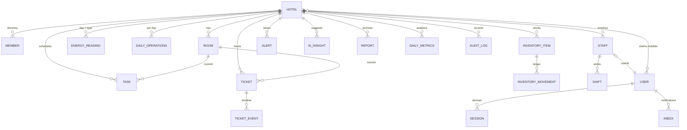

# ۲ و ۳. طراحی دیتابیس و Firestore Schema

## اصول طراحی

1. **Tenant-scoped.** همهٔ دادهٔ عملیاتی زیر `hotels/{hotelId}` است. یک claim و یک الگوی Rule برای ایزوله‌سازی کافی است، و در PostgreSQL آینده هم به ستون `hotel_id` با Row-Level Security نگاشت می‌شود.
2. **Read-optimized با denormalization کنترل‌شده.** فیلدهایی مثل `roomNumber`، `assigneeName` و `staffName` در اسناد کپی می‌شوند تا لیست‌ها بدون join خوانده شوند. منبع حقیقت همان سند اصلی است.
3. **کلیدهای طبیعی و idempotent:**
   - `energyReadings/{yyyy-MM-dd}_{type}`
   - `dailyOperations/{yyyy-MM-dd}`
   - `dailyMetrics/{yyyy-MM-dd}`
   - `alerts/{dedupeKey}`
   - `aiInsights/{rule}_{subject}`

   ثبت دوباره برای همان روز به‌جای ساختن رکورد تکراری، سند قبلی را به‌روز می‌کند.
4. **Ledger تغییرناپذیر** برای هر چیزی که «تاریخچه» دارد: حرکات انبار، رویدادهای تیکت و Audit log.
5. **Actor stamp** (`{uid, name, role}`) روی هر نوشتن. Rules بررسی می‌کنند که `uid` همان کاربر باشد.
6. **Day key به وقت تهران** (`yyyy-MM-dd`) کنار `Timestamp`. گروه‌بندی روزانه، ایندکس‌ها و گزارش‌ها همه بر اساس روز هتل هستند، نه UTC.
7. **`source` روی داده‌های قابل‌اتوماسیون** (`manual | smartMeter | iot | import`) تا مسیر IoT بدون تغییر Schema اضافه شود.

## نمودار موجودیت‌ها (منطقی)



## Firestore Schema

نمادها: 🔒 فقط سرور می‌نویسد (Cloud Functions)، 🧾 تغییرناپذیر، `ts` = Timestamp، `actor` = `{uid, name, role}`.

### مجموعه‌های سراسری

| مسیر | فیلدها | توضیح |
|---|---|---|
| `permissions/{code}` 🔒 | `code, module` | کاتالوگ ۳۲ مجوز (Permissions) |
| `roleTemplates/{role}` 🔒 | `role, tier, permissions[], assignableRoles[], version` | قالب ۱۵ نقش (Role Templates). از `rbac.ts` تولید می‌شود |
| `users/{uid}` 🔒* | `nationalId, nationalIdMasked, fullName, role, hotelIds[], primaryHotelId, staffId, status (active/suspended/disabled), mustChangePassword, passwordChangedAt, locale, createdAt` | *کاربر فقط می‌تواند `mustChangePassword` (فقط به false)، `passwordChangedAt` و `locale` را تغییر دهد |
| `users/{uid}/sessions/{deviceId}` | `platform, model, osVersion, appVersion, pushToken, createdAt, lastSeenAt, revokedAt` | دستگاه‌های فعال. ثبت از طریق `authRegisterSession` |
| `users/{uid}/inbox/{id}` 🔒* | `hotelId, title, body, category, severity, route, createdAt, readAt` | صندوق اعلان. کاربر فقط `readAt` را تغییر می‌دهد یا سند را حذف می‌کند |
| `users/{uid}/usage/ai_{yyyy-MM-ddTHH}` 🔒 | `count, updatedAt` | سهمیهٔ ساعتی دستیار AI |

### `hotels/{hotelId}`

```jsonc
{
  "name": "هتل بزرگ زرین", "city": "تهران", "stars": 5, "roomCount": 60,
  "timezone": "Asia/Tehran", "currency": "IRR", "status": "active",
  "settings": {
    "energyDailyBaseline": { "electricity": 2400, "water": 38, "gas": 310 },
    "energyTariff":        { "electricity": 3200, "water": 21000, "gas": 4100 },   // ریال به ازای هر واحد
    "energyAlertThresholdPct": 15,
    "maintenanceSlaHours": { "critical": 2, "high": 8, "medium": 24, "low": 72 },
    "targetCleanMinutes":  { "checkoutClean": 35, "stayoverClean": 20, "deepClean": 90, "inspection": 10, "turndown": 10 },
    "sessionTimeoutMinutes": 30
  },
  "subscription": { "plan": "pilot", "status": "active" }
}
```

فقط نقش‌های دارای `hotel.settings` می‌توانند `settings` را تغییر دهند.

### زیرمجموعه‌های هتل

| مسیر | فیلدهای اصلی | نکات |
|---|---|---|
| `members/{uid}` 🔒 | `fullName, nationalIdMasked, role, tier, status` | دفترچهٔ کاربران هتل برای مدیریت کاربران و هدف‌گیری اعلان |
| `roleOverrides/{role}` | `permissions[]` | محدودسازی نقش برای همین هتل (فقط سوپرادمین) |
| `rooms/{roomId}` | `number, floor, type (single/double/twin/suite/deluxe), status, previousStatus, note, updatedAt, updatedBy: actor, updatedByName` | `status` ∈ `vacantClean, vacantDirty, cleaningInProgress, occupied, outOfOrder` |
| `tasks/{taskId}` | `kind: "housekeeping", day, roomId, roomNumber, type, status, priority, assigneeId, assigneeName, dueAt, notes, startedAt, completedAt, durationMinutes🔒, createdBy: actor, createdByName, updatedAt, updatedBy` | `type` ∈ `checkoutClean, stayoverClean, deepClean, inspection, turndown`. `status` ∈ `pending, inProgress, done, cancelled`. `priority` ∈ `low, normal, high, urgent` |
| `maintenanceTickets/{id}` | `title, description, category, priority, status, reportedById, reportedByName, reportedByRole, roomId, roomNumber, area, photoPaths[], assigneeId, assigneeName, slaDueAt, resolvedAt, resolutionNote, createdAt, updatedAt, updatedBy` | `category` ∈ `hvac, electrical, plumbing, furniture, appliance, itNetwork, structural, other`. `status` ∈ `open, assigned, inProgress, onHold, resolved, closed, cancelled` |
| `maintenanceTickets/{id}/events/{id}` 🧾 | `type (created/statusChanged/assigned/comment), fromStatus, toStatus, note, actor, actorName, at` | Timeline کامل تیکت |
| `energyReadings/{day}_{type}` | `type (electricity/water/gas), unit, day, date, consumption, meterValue, meterId, cost, note, source, recordedBy: actor, recordedByName, createdAt` | یک سند برای هر روز و هر نوع. شکل سند در ورود دستی، کنتور هوشمند و IoT یکسان است |
| `dailyOperations/{day}` | `day, date, roomsAvailable, roomsOccupied, guests, roomRevenue, fnbRevenue, otherRevenue, source, updatedBy, updatedAt` | ورودی KPIهای اشغال، ADR و RevPAR. در فاز بعد از PMS پر می‌شود |
| `inventoryItems/{id}` | `name, sku, category, unit, quantity, reorderLevel, reorderQuantity, unitCost, location, supplier, lastMovementId, updatedAt, updatedBy` | `quantity` فقط همراه یک movement تغییر می‌کند |
| `inventoryMovements/{id}` 🧾 | `itemId, itemName, type (receive/issue/adjust/waste), delta, quantityBefore, quantityAfter, reason, actor, actorName, createdAt` | Ledger |
| `staff/{staffId}` | `fullName, department, position, role, userId, phone, active` | `department` ∈ ۹ دپارتمان |
| `shifts/{id}` | `staffId, staffName, userId, department, day, date, type (morning/evening/night), startTime, endTime, status (scheduled/checkedIn/completed/absent), createdBy` | |
| `alerts/{dedupeKey}` 🔒* | `type (energySpike/lowStock/maintenanceSla/criticalTicket/system/ai), severity, title, message, route, audienceRoles[], status (open/acknowledged/resolved), source, data, createdAt, acknowledgedBy, resolvedAt` | با dedupe یک هشدار باز برای هر موضوع. فقط audience می‌تواند آن را acknowledge کند |
| `notifications/{id}` 🔒 | `title, body, category, severity, route, audienceRoles[], audienceUserIds[], recipientCount, createdBy, createdAt` | سابقهٔ اعلان‌های ارسالی برای ممیزی. نسخهٔ هر کاربر در `inbox` است |
| `aiInsights/{rule}_{subject}` 🔒* | `rule, category, title, summary, recommendation, evidence[], confidence, priority, estimatedMonthlySaving, route, audienceRoles[], status (active/accepted/dismissed/implemented), source (rules/llm), model, createdAt, updatedAt` | مدیر وضعیت را تغییر می‌دهد که بازخورد حلقهٔ یادگیری است |
| `aiConversations/{id}` 🔒 | `uid, role, question, answer, model, status, usage, at` | لاگ دستیار برای کیفیت، هزینه و ممیزی |
| `reports/{id}` | `type, from, to, format: "pdf", storagePath, sizeBytes, createdBy, createdByName, createdAt` | فایل در `Storage: hotels/{h}/reports/{id}.pdf` |
| `dailyMetrics/{day}` 🔒 | `occupancyRate, roomsOccupied, adr, revpar, totalRevenue, energy{…}, energyCost, electricityPerOccupiedRoom, electricityVsBaselinePct, maintenance{open, overdue, critical, avgResolutionHours…}, housekeeping{tasks, done, avgCheckoutCleanMinutes}, inventory{lowStock, outOfStock, stockValue}, rooms{outOfOrder,total}, version` | خروجی موتور تحلیل، یک سند در روز |
| `auditLogs/{id}` 🔒🧾 | `action, resource{collection,id}, actor{uid, role, name, type}, changes{field:{from,to}}, source (client/function/n8n/iot), at` | |
| `integrations/{id}` 🔒 | پیکربندی اتصال‌ها (PMS، کنتورها) | رزرو برای فاز بعد |

### Storage

| مسیر | محدودیت |
|---|---|
| `hotels/{h}/maintenance/{ticketId}/{file}` | فقط عضو هتل. `image/*` و کمتر از ۸MB |
| `hotels/{h}/reports/{reportId}.pdf` | خواندن با `reports.view` و نوشتن با `reports.generate`. `application/pdf` و کمتر از ۲۰MB |

### ایندکس‌های ترکیبی (`firestore.indexes.json`)

| Collection | فیلدها | مصرف |
|---|---|---|
| maintenanceTickets | `status ↑, createdAt ↓` | صف تیکت‌های فعال |
| maintenanceTickets | `reportedById ↑, (status ↑,) createdAt ↓` | «گزارش‌های من» |
| maintenanceTickets | `assigneeId ↑, (status ↑,) createdAt ↓` | «کارهای من»، برای تکنسین |
| tasks | `kind ↑, day ↑, assigneeId ↑` | تسک‌های امروز مستخدم |
| inventoryMovements | `itemId ↑, createdAt ↓` | تاریخچهٔ هر کالا |
| alerts | `audienceRoles ∋, (status ↑,) createdAt ↓` | هشدارهای هر نقش |
| aiInsights | `status ↑, createdAt ↓` | پیشنهادهای فعال |
| members | `role ↑, status ↑` | هدف‌گیری اعلان بر اساس نقش |

## پیاده‌سازی در PocketBase

همین مدل در `pocketbase/pb_migrations` به‌صورت collectionهای تخت پیاده شده است. به‌جای زیرمجموعه‌های `hotels/{id}/…`، هر رکورد یک relation به نام `hotel` دارد.

- نام collectionها همان نام‌های بالاست. استثناها: `ticketEvents` (به‌جای زیرمجموعهٔ events)، `inbox` (با فیلد `user`)، `sessions` و `aiUsage`.
- فیلدهای actor (مثل `updatedBy` و `reportedBy`) relation به `users` هستند و نام هر کدام در یک فیلد متنی کنار آن (`…Name`) ذخیره می‌شود.
- عکس خرابی‌ها و PDF گزارش‌ها فیلد فایل **protected** همان رکورد هستند (حداکثر ۸MB و ۲۰MB).
- کلیدهای یکتا با ایندکس UNIQUE تعریف شده‌اند: `(hotel, number)` برای اتاق، `(hotel, day, type)` برای انرژی، `(hotel, day)` برای عملیات روزانه و KPI، و `(hotel, dedupeKey)` برای هشدار.
- `users` همان collection auth پیش‌فرض PocketBase است با این فیلدها: `nationalId` (hidden و unique، فیلد identity ورود)، `role`، `permissions` (relation به کاتالوگ، محاسبه‌شده توسط سرور)، `hotels`، `primaryHotel`، `status` و `mustChangePassword`.

## نگاشت به PostgreSQL (فاز بک‌اند اختصاصی)

Schema به‌گونه‌ای طراحی شده که مهاجرت به PostgreSQL مکانیکی باشد:

| Firestore | PostgreSQL |
|---|---|
| `hotels/{h}/rooms/{id}` | `rooms(id uuid pk, hotel_id fk, number, floor, type, status, …)` با RLS: `hotel_id = ANY(current_setting('app.hotel_ids'))` |
| `…/events`، `inventoryMovements`، `auditLogs` | جدول‌های append-only (`REVOKE UPDATE, DELETE`) |
| `energyReadings/{day}_{type}` | `energy_readings(hotel_id, day, type) UNIQUE` و `ON CONFLICT DO UPDATE`. برای دادهٔ IoT با فرکانس بالا: TimescaleDB hypertable |
| `dailyMetrics/{day}` | Materialized view یا جدول rollup |
| `actor` map | ستون‌های `actor_uid, actor_role` و FK به `users` |
| Custom claims | جدول‌های `user_hotel_roles(user_id, hotel_id, role)` و `role_permissions` |

قرارداد API نسخهٔ v1 ([۰۶](06-api.md)) روی هر دو بک‌اند یکسان می‌ماند، پس اپ و n8n تغییر نمی‌کنند.
