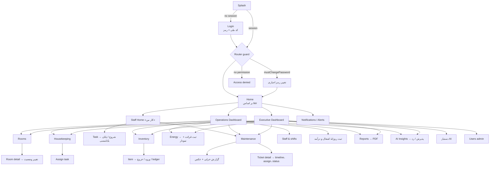

# ۵، ۶ و ۷. تجربهٔ کاربری: Design System، UI Flow، User Journey و Wireframe

## Design System: «Luxury × Technology × Hotel × Executive»

| Token | Dark (پیش‌فرض) | Light | کاربرد |
|---|---|---|---|
| Background | `#0A0A0B` Black | `#F6F5F1` Paper | زمینهٔ صفحه |
| Surface | `#131416` Charcoal / `#1A1B1E` Raised | `#FFFFFF` | کارت‌ها |
| Surface high | `#222429` | `#EDEBE5` | ورودی‌ها، chip |
| Outline | `#2E3137` Graphite | `#DCD9D1` Hairline | خطوط باریک ۱px |
| Text primary | `#F4F3EF` Ivory | `#111215` Ink | عدد و عنوان |
| Text secondary | `#8C919A` Metallic / `#B9BDC4` Silver | `#5A5F68` | برچسب، توضیح |
| **Gold (محدود)** | `#C8A25A` | `#94742F` | فقط اکشن اصلی، مقصد فعال ناوبری و مهم‌ترین عدد صفحه |
| Status | success `#36A374`، warning `#CC7D2A`، danger `#D9533F`، info `#4C8DD6`، neutral `#7D828B` | معادل‌های تیره‌تر | فقط برای وضعیت، و همیشه همراه آیکن و برچسب |
| Series (نمودار) | `#8A86E0` | `#5B55C4` | رنگ دادهٔ تک‌سری. عمداً از رنگ‌های وضعیت و طلایی متمایز است |

- **تایپوگرافی:** Vazirmatn (۳۰۰ تا ۷۰۰)، در اپ و در PDF گزارش. اعداد KPI درشت و `w600`، برچسب‌ها کوچک و `metallic`.
- **فاصله‌ها:** `Insets` 4/8/12/16/24/32. **گوشه‌ها (`Radii`):** 8/14/20. **سایه:** ندارد. عمق با تفاوت رنگ surface و خط ۱px ساخته می‌شود.
- **دسترس‌پذیری:**
  - هدف لمسی حداقل ۴۸dp.
  - وضعیت هیچ‌وقت فقط با رنگ نشان داده نمی‌شود (`StatusPill` = رنگ + آیکن + متن).
  - کنتراست متن مطابق AA.
  - پشتیبانی از بزرگ‌نمایی متن سیستم.
- **قواعد نمودار (Data-viz):**
  - یک محور؛ هیچ نمودار دومحوره.
  - خط ۲px و میله با گوشهٔ ۴px.
  - grid کم‌رنگ.
  - baseline انرژی با legend «خط مبنا» نمایش داده می‌شود، نه برچسب روی میله‌ها.
  - مقایسهٔ دوره‌ها بر اساس **میانگین روزانه** است، نه جمع، تا دوره‌های ناقص گمراه‌کننده نباشند.
  - پالت وضعیت اتاق‌ها با ابزار اعتبارسنجی CVD (کوررنگی) بررسی شده است.
- **کامپوننت‌ها** (`core/widgets`): `KpiCard`، `ZCard`، `StatusPill`، `SectionHeader`، `ResponsiveGrid`، `TrendLineChart`، `DailyBarChart`، `StackedStatusBar`، `EmptyState`، `ErrorView`، `AppShell`.

## UI Flow (نقشهٔ صفحات)



## User Journey (سفر کاربر)

### مستخدم (Housekeeper): «اتاق را انتخاب کن، وضعیت را ببین، کار را انجام بده، ثبت کن»

| گام | کار کاربر | سیستم | تعداد لمس |
|---|---|---|---|
| ۱ | ورود با کد ملی (یک بار در شیفت) | نشست ۳۰ دقیقه‌ای روی دستگاه مشترک | — |
| ۲ | «کار من»: کارت اتاق بعدی، مثلاً ۲۰۴ (نیاز به نظافت، اولویت بالا) | فقط تسک‌های امروزِ همین کاربر | ۰ |
| ۳ | **شروع نظافت** | تسک ← inProgress و اتاق ← در حال نظافت (یک Transaction) | ۱ |
| ۴ | **پایان** | تسک ← done و اتاق ← آماده. مدت نظافت برای KPI ثبت می‌شود. پذیرش فوراً اتاق آماده را می‌بیند | ۱ |
| ۵ | (اختیاری) **گزارش خرابی**: دسته، توضیح کوتاه، عکس | تیکت با SLA، هشدار به مدیر تعمیرات، Push، و در صورت critical پیام بله | ۴ تا ۵ |

### تکنسین تعمیرات

دریافت Push «خرابی بحرانی: اتاق ۴۰۵ – تهویه» ← تیکت (عکس، محل، مهلت SLA) ← **شروع کار** ← **حل شد** و یادداشت. اتاق دوباره به چرخهٔ نظافت برمی‌گردد و هشدار SLA خودکار بسته می‌شود.

### مدیر انرژی

ثبت قرائت روزانه (برق، آب، گاز). نمودار ۳۰ روزه با خط مبنا و درصد اختلاف با دورهٔ قبل نمایش داده می‌شود. اگر مصرف بیش از ۱۵٪ از baseline بالاتر باشد، هشدار و پیام بله ارسال می‌شود. صبح روز بعد، insight «شدت مصرف برق به ازای اتاق اشغال» همراه با صرفه‌جویی تخمینی و دلایل ظاهر می‌شود.

### مدیر کل (GM): «در ۳۰ ثانیه بفهم هتل چه وضعی دارد»

| گام | صفحه | اطلاعات |
|---|---|---|
| ۱ | ایمیل یا پیام بله ساعت ۰۷:۱۵ | خلاصهٔ مدیریتی: KPIهای دیروز، هشدارها، ۳ اولویت امروز |
| ۲ | Executive Dashboard | اشغال، ADR، RevPAR، درآمد، انرژی در برابر مبنا، تیکت‌های باز و SLA، اتاق‌های خارج از سرویس |
| ۳ | هشدارها | acknowledge، یا رفتن مستقیم به تیکت یا کالا |
| ۴ | پیشنهادهای AI | «چرا؟» (evidence) ← پذیرش، رد یا اجرا‌شده |
| ۵ | دستیار | «چرا مصرف برق زیاد شده؟» ← پاسخ مستند به داده‌های هتل |
| ۶ | گزارش | PDF هفتگی یا ماهانه برای مالک |

### مالک هتل

داشبورد Executive (فقط‌خواندنی)، بینش‌ها، صرفه‌جویی تخمینی، گزارش PDF ماهانه، و تعریف مدیرکل و کاربران.

## Wireframeها

اسکرین‌شات‌های واقعی اپ (بک‌اند دمو) در [`app/tool/screenshots`](../app/tool/screenshots) قرار دارند. نمای ساختاری صفحات کلیدی (موبایل، RTL):

**ورود**
```
┌────────────────────────────┐
│          ◆ زرین هوشمند       │
│   پلتفرم هوشمند بهینه‌سازی هتل │
│ ┌────────────────────────┐ │
│ │ کد ملی      ۰۰۱۲۳۴۵۶۷۹ │ │
│ └────────────────────────┘ │
│ ┌────────────────────────┐ │
│ │ رمز عبور        ••••• 👁 │ │
│ └────────────────────────┘ │
│ [████████ ورود ████████]   │ ← تنها عنصر طلایی
│  حساب را مدیر هتل می‌سازد    │
│ ── دمو: انتخاب نقش ──        │
│ (مدیرکل)(مستخدم)(تعمیرات)…  │
└────────────────────────────┘
```

**داشبورد مدیرکل**
```
┌────────────────────────────┐
│ ☰  هتل بزرگ زرین    🔔³  👤  │
│ دوشنبه ۱۳ مهر ۱۴۰۵          │
│ ┌──────────┐ ┌──────────┐  │
│ │ اشغال      │ │ RevPAR    │  │
│ │ ۷۸٪  ▲۴٪  │ │ ۶۷ میلیون │  │
│ └──────────┘ └──────────┘  │
│ ┌──────────┐ ┌──────────┐  │
│ │ برق/مبنا  │ │ تیکت باز  │  │
│ │ +۲۲٪ ⚠    │ │ ۷ (۲ SLA) │  │
│ └──────────┘ └──────────┘  │
│ هشدارها ─────────────────── │
│ ⛔ خرابی بحرانی اتاق ۴۰۵  ›  │
│ ⚠ مصرف برق ۲۲٪ بالاتر از مبنا ›│
│ پیشنهادهای AI ───────────── │
│ ✦ کاهش مصرف برق اتاق‌های خالی │
│   صرفه‌جویی: ۴۲ میلیون/ماه  › │
│ وضعیت اتاق‌ها ────────────── │
│ ▇▇▇▇▇▇▇▇▇▇▇▆▆▅▅▃▂ (stacked) │
│ آماده·نظافت·کثیف·اشغال·خارج   │
│ روند ۳۰ روزه ────────────── │
│   ╱╲_╱╲__╱‾‾╲_╱‾             │
├────────────────────────────┤
│ 🏠  🛏  🔧  ⚡  ⋯             │
└────────────────────────────┘
```

**«کار من»: مستخدم**
```
┌────────────────────────────┐
│ سلام فاطمه 👋   شیفت صبح ۷–۱۵ │
│ امروز: ۳ از ۸ انجام شد ▓▓▓░░ │
│ ┌────────────────────────┐ │
│ │ اتاق ۲۰۴ · نظافت خروج    │ │
│ │ ● نیاز به نظافت  ⬆ بالا  │ │
│ │ [████ شروع نظافت ████]  │ │ ← یک لمس
│ └────────────────────────┘ │
│ ┌────────────────────────┐ │
│ │ اتاق ۲۰۵ · در حال نظافت │ │
│ │ ⏱ ۱۸ دقیقه   [پایان ✓]   │ │ ← یک لمس
│ └────────────────────────┘ │
│ بعدی: ۲۰۹ · ۱۰۲ · ۱۰۷       │
│ [ ⚠ گزارش خرابی ]           │
├────────────────────────────┤
│ 🏠   🧹   🛏   🔧            │
└────────────────────────────┘
```

**گزارش خرابی**
```
┌────────────────────────────┐
│ ← گزارش خرابی               │
│ مکان: [اتاق ۲۰۴ ▾] / فضای عمومی│
│ دسته: (تهویه)(برق)(لوله‌کشی)…│
│ اولویت: (کم)(متوسط)(بالا)(بحرانی)│
│ عنوان: [کولر صدا می‌دهد     ]│
│ توضیح: [                   ]│
│ 📷 [+] [img] [img]          │
│ [████████ ثبت ████████]     │
│ مهلت رسیدگی: ۸ ساعت (SLA)   │
└────────────────────────────┘
```

**انرژی**
```
┌────────────────────────────┐
│ انرژی      (برق)(آب)(گاز)   │
│ میانگین روزانه ۲٬۹۴۰ kWh    │
│ +۱۸٪ نسبت به دورهٔ قبل ⚠     │
│ ┃ ▂▃▃▂▃▄▃▂▃▃▂▃▅▆▇▇          │
│ ┃- - - - - - - - - (مبنا)    │
│ ■ مصرف روزانه  ┄ خط مبنا     │
│ [+ ثبت قرائت امروز]          │
│ قرائت‌های اخیر ───────────── │
│ ۱۲ مهر  ۳٬۰۱۰ kWh  دستی  ›  │
└────────────────────────────┘
```

**دستیار AI**
```
┌────────────────────────────┐
│ ← دستیار هوشمند              │
│ (چرا مصرف برق زیاد شده؟)      │
│ (کدام خرابی‌ها از SLA گذشته‌اند؟)│
│        ┌───────────────────┐│
│        │چرا مصرف برق زیاد شده؟││
│        └───────────────────┘│
│┌──────────────────────┐    │
││ مصرف برق ۴ روز اخیر ۲۲٪  │    │
││ بالاتر از مبناست، در حالی  │    │
││ که اشغال ثابت بوده… ۱) …  │    │
││ داده‌ها: برق ۴ روز · اشغال  │    │
│└──────────────────────┘    │
│ [ پرسش خود را بنویسید…  ➤ ] │
└────────────────────────────┘
```

**تبلت و دسکتاپ (عرض ۸۴۰ و بیشتر):** `NavigationRail` در سمت راست (RTL). grid داشبورد (`ResponsiveGrid`) تا هر تعداد ستونی که جا شود، حداکثر ۶ ستون، گسترده می‌شود.
